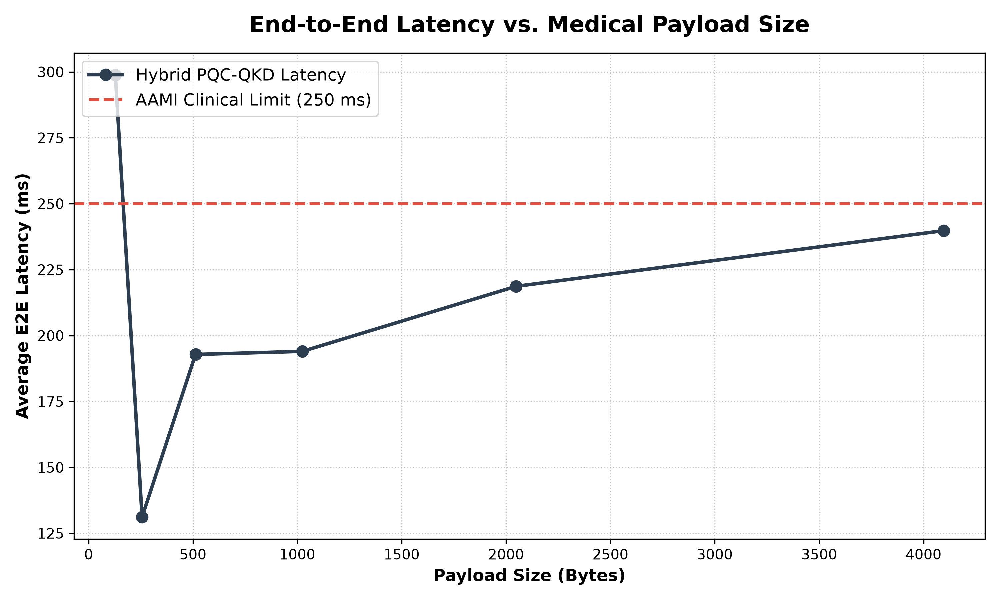
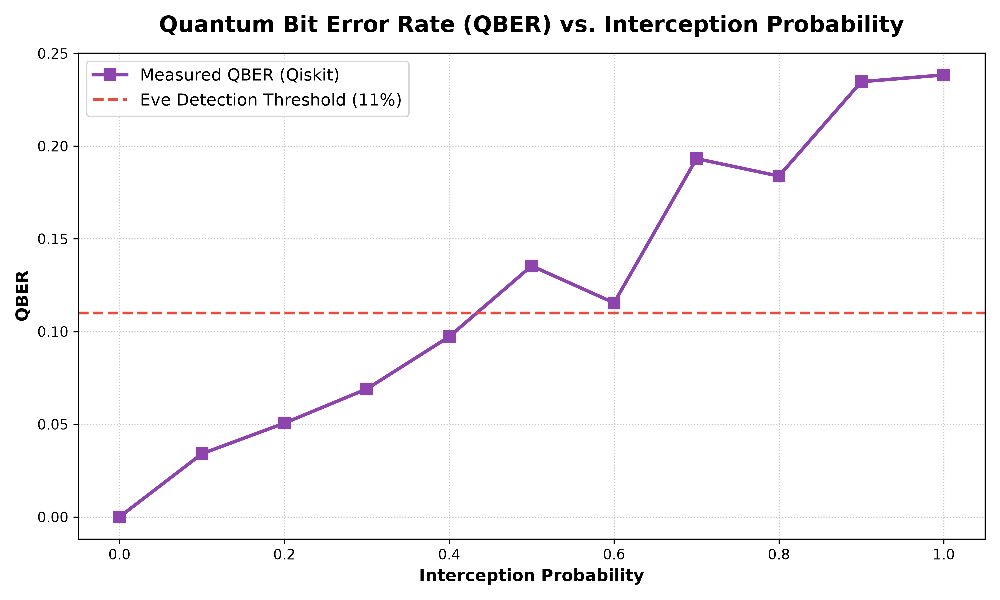
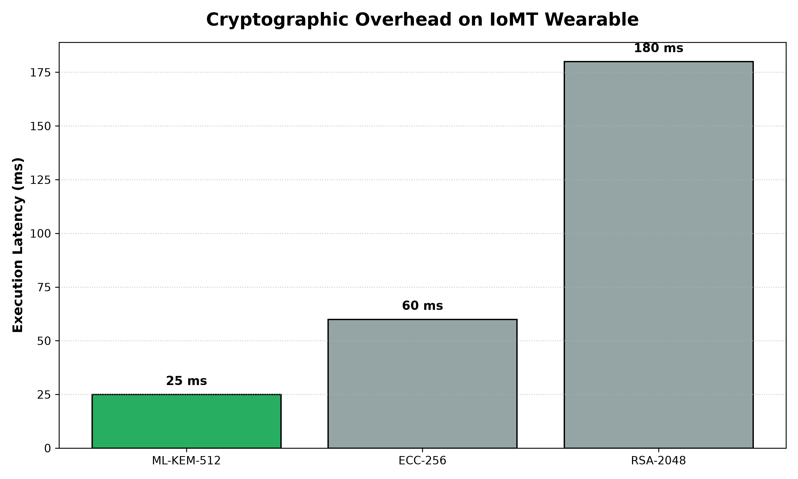
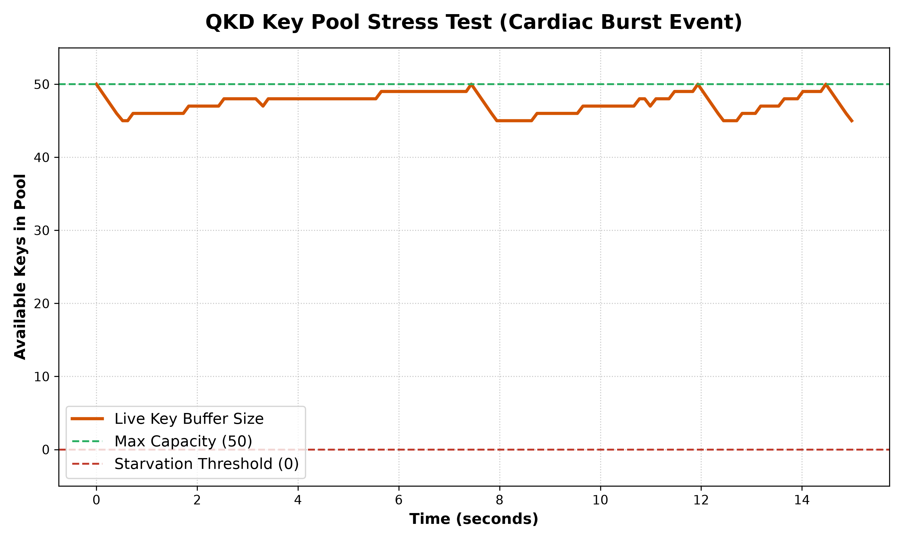

# Hybrid PQC-QKD Edge Computing Framework for IoMT

## Abstract
This repository contains a full-stack, distributed systems simulation of a **3-Tier Hybrid Quantum-Resistant Architecture** for the Internet of Medical Things (IoMT). As cryptographically relevant quantum computers (CRQCs) threaten classical encryption (RSA/ECC), the healthcare industry must transition to quantum-safe protocols.

However, running heavy Post-Quantum Cryptography (PQC) algorithms directly on low-power wearables causes unacceptable computational delays ("Buffer Bloat") that violate clinical safety thresholds. Conversely, pure Quantum Key Distribution (QKD) is physically impossible for mobile patients due to hardware constraints.

This framework successfully bridges the two paradigms:
1. **Tier 1 (Wearable):** Uses an optimized ML-KEM-512 PQC layer for the short-range wireless hop.
2. **Tier 2 (Edge Gateway):** Acts as a secure cryptographic translator.
3. **Tier 3 (Datacenter):** Secures the long-haul optical backbone utilizing a simulated IBM Qiskit BB84 QKD protocol.

## System Architecture

```text
+-----------------------+              +-----------------------+               +-----------------------+
|  TIER 1 (Wearable)    |              | TIER 2 (Edge Gateway) |               |  TIER 3 (Datacenter)  |
|                       |              |                       |               |                       |
| [ PhysioNet Sensors ] |              | [ ML-KEM Decapsul.  ] |               | [ BB84 QKD Receiver ] |
|          |            |              |          |            |               |          |            |
| [ ML-KEM-512 Encap  ] |==[ UDP ]====>| [ Crypto Translator ] |==[ Fiber ]===>| [ AES-GCM Decrypt ]   |
|          |            | (RSSI Drop)  |          |            |   (Qiskit)    |                       |
| [ AES-GCM Encrypt   ] |              | [ QKD Re-Encryption ] |               |                       |
+-----------------------+              +-----------------------+               +-----------------------+
```

## Repository Structure
*   `src/`: Core cryptographic nodes, physics engine, and data ingestion logic.
*   `tests/`: End-to-end integration scripts and rigorous benchmarking tests.
*   `dashboard/`: Rich-based Terminal User Interfaces (TUI) for real-time visualization.
*   `assets/`: Empirical Matplotlib results for academic publication.

## Installation

Ensure you have Python 3.10+ installed.

1. **Create a Virtual Environment:**
   ```bash
   python3 -m venv .venv
   source .venv/bin/activate
   ```

2. **Install Requirements:**
   ```bash
   pip install -r requirements.txt
   ```

## Usage

### 1. Run the Live 3-Tier Terminal Dashboard
Launch the interactive `rich` TUI to watch the clinical telemetry stream through the PQC and QKD pipelines in real-time.
```bash
cd dashboard
python tui_better.py
```
*(Press `1`, `2`, or `3` to trigger various interactive physical and cyber attack scenarios!)*

### 2. Run the Academic Benchmarks
Execute the headless benchmarking engines to generate the empirical Matplotlib graphs.
```bash
cd tests
python benchmark_engine.py
python benchmark_extended.py
```
*(Graphs will be saved in the `assets/` directory).*

## Empirical Results

### 1. End-to-End Latency vs. Payload Size


### 2. QBER vs. Interception Probability


### 3. Cryptographic Algorithm Overhead


### 4. QKD Key Pool Stress Test

